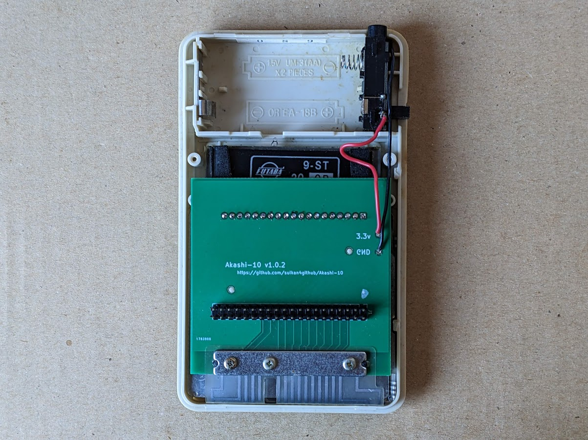

# Akashi-10
Test board of the EL-210 calculator
## Description
This board is developed to test the functionality of the EL-210 Calculator controller. The [EL-210](https://vintage-technology.club/pages/calculators/sharp/sharpel210.htm) was released from SHARP Corporation at 1980. 

This board tests its internal 9 digits VFD and 9x3 matrix keyboard. All signals and power from internal AA*2 batteries are taken out by 40pin headers. 
## Pin assignment
The ping assignment of the 40pin headers are as followings : 

 Pin | Symbol | Pin | Symbol 
 ----|--------|-----|-------
 1   | H1     | 2   | H2
 3   | a      | 4   | 
 5   | D8     | 6   | KR0
 7   | g      | 8   | KR1
 9   | D7     | 10  | KR2
 11  | f      | 12  | KC0
 13  | D6     | 14  | KC1
 15  | e      | 16  | KC2
 17  | D5     | 18  | KC3
 19  | D4     | 20  | KC4
 21  | d      | 22  | KC5
 23  | D3     | 24  | KC6
 25  | dp     | 26  | KC7
 27  | D2     | 28  | KC8
 29  | c      | 20  | 
 31  | D1     | 32  | 
 33  | b      | 34  | 
 35  | D0     | 36  | 
 37  | H2     | 38  | 
 39  | H1     | 20  | 

Where odd and even pins are signals of the VFD and the key matrix. 
- H1, H2 : Heater.
- a .. f and dp : Segments ( Anode ).
- D0 .. D8 : Digits ( grid ). 
- R1 .. R3 : Row 1 .. 3 of the key matrix.
- C0 .. C8 : Column 0 .. 8 of the key matrix.

## Gallery
This is photo of the version 1.0.2.

